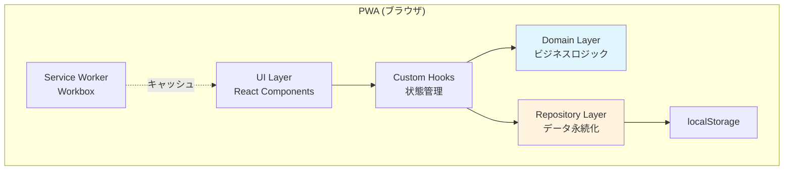

# 設計書: スマート買い物リスト

## 概要

スマート買い物リストは、週間献立の作成から買い物リストの自動生成、店舗レイアウトに基づくピッキング順序の最適化までを一貫して行うPWA（Progressive Web App）である。

### 技術スタック

| レイヤー | 技術 | 理由 |
|---------|------|------|
| 言語 | TypeScript | 型安全性によるバグ防止 |
| UIフレームワーク | React 18 | コンポーネントベースのUI構築 |
| ビルドツール | Vite | 高速ビルド・HMR |
| データ永続化 | localStorage | サーバー不要、シンプルなKVストア |
| オフライン対応 | Workbox (Service Worker) | スーパー内の電波が弱い環境でも動作 |
| テスト | Vitest + fast-check | ユニットテスト + プロパティベーステスト |
| ホスティング | GitHub Pages / Cloudflare Pages | 無料の静的サイトホスティング |

### 設計方針

- **クライアント完結型**: バックエンドサーバーを持たず、すべてのデータをブラウザのlocalStorageに保存する
- **オフラインファースト**: Service Workerによりオフラインでも全機能が利用可能
- **モバイルファースト**: スマホでの買い物利用を主要ユースケースとしてUIを設計
- **ドメイン駆動**: ビジネスロジック（材料集約、並べ替え）をUIから分離し、純粋関数として実装

## アーキテクチャ

### 全体構成



### レイヤー構成

アプリケーションは以下の4層で構成する：

1. **UI Layer** — Reactコンポーネント。表示とユーザー操作のみを担当
2. **Hooks Layer** — Custom Hooks。UIとドメインロジックの橋渡し、状態管理
3. **Domain Layer** — 純粋関数によるビジネスロジック。UIに依存しない
4. **Repository Layer** — localStorageへのCRUD操作を抽象化

### ディレクトリ構成

```
src/
├── components/          # Reactコンポーネント
│   ├── recipe/          # レシピ関連
│   ├── meal-plan/       # 献立関連
│   ├── shopping-list/   # 買い物リスト関連
│   ├── store-layout/    # 店舗レイアウト関連
│   └── common/          # 共通コンポーネント
├── hooks/               # Custom Hooks
├── domain/              # ビジネスロジック（純粋関数）
│   ├── recipe.ts
│   ├── meal-plan.ts
│   ├── shopping-list.ts # 買い物リスト生成エンジン
│   └── sorting.ts       # 並べ替えエンジン
├── repositories/        # データ永続化
│   └── local-storage.ts
├── types/               # 型定義
│   └── index.ts
├── constants/           # 定数（デフォルトカテゴリ等）
├── App.tsx
└── main.tsx
```

## コンポーネントとインターフェース

### Domain Layer — ビジネスロジック

ドメインレイヤーは純粋関数で構成し、テスト容易性を最大化する。

#### 買い物リスト生成エンジン (`domain/shopping-list.ts`)

```typescript
/**
 * 週間献立から買い物リストを生成する。
 * 同一材料（材料名+単位が一致）の分量を合算し、
 * 各材料の使用元（曜日・レシピ名）を内訳として保持する。
 */
function generateShoppingList(mealPlan: WeeklyMealPlan): ShoppingList;

/**
 * 材料の合算ロジック。
 * 同一材料名かつ同一単位の材料を1つにまとめ、分量を合計する。
 */
function aggregateIngredients(
  allIngredients: IngredientWithSource[]
): AggregatedIngredient[];
```

#### 並べ替えエンジン (`domain/sorting.ts`)

```typescript
/**
 * 買い物リストを店舗レイアウトのピッキング順序に並べ替える。
 * 通路順序 → セクション順序 の優先度で並べ替え、
 * 未分類の材料はリスト末尾にまとめる。
 *
 * 不変条件: 並べ替え前後で材料の総数と各材料の分量が一致する。
 */
function sortByStoreLayout(
  shoppingList: ShoppingList,
  storeLayout: StoreLayout,
  categoryMapping: CategoryMapping
): SortedShoppingList;

/**
 * 材料のカテゴリから、店舗レイアウト上の位置（通路・セクション）を解決する。
 * カテゴリが未割り当ての場合は null を返す。
 */
function resolveLocation(
  category: string | null,
  storeLayout: StoreLayout
): StoreLocation | null;
```

#### レシピバリデーション (`domain/recipe.ts`)

```typescript
/**
 * レシピデータのバリデーション。
 * 料理名が空でないこと、材料リストが1つ以上あることを検証する。
 */
function validateRecipe(recipe: RecipeInput): ValidationResult;
```

#### 献立操作 (`domain/meal-plan.ts`)

```typescript
/**
 * 週間献立が空（レシピが1つも割り当てられていない）かどうかを判定する。
 */
function isMealPlanEmpty(mealPlan: WeeklyMealPlan): boolean;

/**
 * 週間献立から全材料を曜日・レシピ名付きで抽出する。
 */
function extractAllIngredients(
  mealPlan: WeeklyMealPlan
): IngredientWithSource[];
```

### Repository Layer — データ永続化

```typescript
interface Repository<T> {
  getAll(): T[];
  getById(id: string): T | null;
  save(item: T): void;
  update(id: string, item: T): void;
  delete(id: string): void;
}

/**
 * localStorage を使用した汎用リポジトリ。
 * 各エンティティタイプごとにキーを分けて保存する。
 * JSON シリアライズ/デシリアライズを内部で行う。
 */
class LocalStorageRepository<T extends { id: string }> implements Repository<T> {
  constructor(private storageKey: string) {}
  // ...
}
```

### Hooks Layer — 状態管理

```typescript
/** レシピのCRUD操作と状態管理 */
function useRecipes(): {
  recipes: Recipe[];
  addRecipe: (input: RecipeInput) => ValidationResult;
  updateRecipe: (id: string, input: RecipeInput) => ValidationResult;
  deleteRecipe: (id: string) => void;
};

/** 週間献立の作成・保存・読み込み */
function useMealPlan(): {
  currentPlan: WeeklyMealPlan;
  assignRecipe: (day: Weekday, recipeId: string) => void;
  removeRecipe: (day: Weekday, recipeId: string) => void;
  savePlan: (name: string) => void;
  loadPlan: (id: string) => void;
  savedPlans: SavedMealPlan[];
};

/** 買い物リストの生成・並べ替え・チェック管理 */
function useShoppingList(): {
  shoppingList: SortedShoppingList | null;
  generate: (mealPlan: WeeklyMealPlan) => void;
  sortByStore: (layoutId: string) => void;
  toggleChecked: (ingredientId: string) => void;
  checkedCount: number;
  uncheckedCount: number;
};
```

## データモデル

### エンティティ定義

```typescript
/** レシピ */
interface Recipe {
  id: string;
  name: string;                    // 料理名
  ingredients: Ingredient[];       // 材料リスト（4人分）
  source?: RecipeSource;           // 参照元（任意）
  createdAt: string;               // 作成日時 (ISO 8601)
  updatedAt: string;               // 更新日時 (ISO 8601)
}

/** 材料 */
interface Ingredient {
  name: string;                    // 材料名
  quantity: number;                // 分量
  unit: string;                    // 単位（g, ml, 個, 本, etc.）
  category: string | null;         // 商品カテゴリ（null = 未分類）
}

/** レシピの参照元 */
interface RecipeSource {
  type: 'book' | 'url';
  bookName?: string;               // 献立本名
  page?: number;                   // ページ番号
  url?: string;                    // サイトURL
}

/** 曜日 */
type Weekday = 'monday' | 'tuesday' | 'wednesday' | 'thursday' | 'friday';

/** 週間献立 */
interface WeeklyMealPlan {
  [key in Weekday]: string[];      // 各曜日に割り当てられたレシピIDの配列
}

/** 保存済み週間献立 */
interface SavedMealPlan {
  id: string;
  name: string;                    // 献立名
  plan: WeeklyMealPlan;
  createdAt: string;               // 作成日時 (ISO 8601)
}

/** 使用元情報付き材料 */
interface IngredientWithSource {
  ingredient: Ingredient;
  day: Weekday;
  recipeName: string;
}

/** 集約済み材料 */
interface AggregatedIngredient {
  name: string;                    // 材料名
  totalQuantity: number;           // 合計分量
  unit: string;                    // 単位
  category: string | null;         // 商品カテゴリ
  sources: {                       // 使用元の内訳
    day: Weekday;
    recipeName: string;
    quantity: number;
  }[];
}

/** 買い物リスト */
interface ShoppingList {
  id: string;
  mealPlanId: string;              // 元の週間献立ID
  items: AggregatedIngredient[];   // 集約済み材料リスト
  createdAt: string;
}

/** 店舗レイアウト */
interface StoreLayout {
  id: string;
  storeName: string;               // 店舗名
  aisles: Aisle[];                 // 通路リスト（巡回順）
}

/** 通路 */
interface Aisle {
  id: string;
  name: string;                    // 通路名
  order: number;                   // 巡回順序（0始まり）
  sections: Section[];             // セクションリスト
}

/** セクション */
interface Section {
  id: string;
  name: string;                    // セクション名（例：野菜コーナー）
  categories: string[];            // このセクションに属する商品カテゴリ
  order: number;                   // セクション内の順序
}

/** カテゴリマッピング（材料カテゴリ → 店舗内位置） */
interface CategoryMapping {
  [category: string]: {
    aisleId: string;
    sectionId: string;
  };
}

/** 店舗内位置 */
interface StoreLocation {
  aisleId: string;
  aisleName: string;
  aisleOrder: number;
  sectionId: string;
  sectionName: string;
  sectionOrder: number;
}

/** 並べ替え済み買い物リスト */
interface SortedShoppingList {
  storeLayoutId: string;
  groups: SortedGroup[];           // 通路・セクション別グループ
  uncategorized: AggregatedIngredient[];  // 未分類材料
}

/** 並べ替えグループ */
interface SortedGroup {
  aisleName: string;
  sectionName: string;
  aisleOrder: number;
  sectionOrder: number;
  items: AggregatedIngredient[];
}

/** 買い物チェックリスト状態 */
interface ChecklistState {
  shoppingListId: string;
  checkedItems: Set<string>;       // チェック済み材料名のセット
}

/** バリデーション結果 */
interface ValidationResult {
  valid: boolean;
  errors: string[];
}
```

### デフォルト商品カテゴリ

```typescript
const DEFAULT_CATEGORIES = [
  '野菜',
  '果物',
  '肉類',
  '魚介類',
  '乳製品',
  '調味料',
  '乾物',
  '冷凍食品',
  '飲料',
  '日用品',
] as const;
```

### localStorage キー設計

| キー | 値の型 | 説明 |
|------|--------|------|
| `sgl:recipes` | `Recipe[]` | 全レシピ |
| `sgl:meal-plans` | `SavedMealPlan[]` | 保存済み週間献立 |
| `sgl:shopping-lists` | `ShoppingList[]` | 買い物リスト |
| `sgl:store-layouts` | `StoreLayout[]` | 店舗レイアウト |
| `sgl:categories` | `string[]` | カスタム商品カテゴリ |
| `sgl:checklist-state` | `ChecklistState` | チェックリスト状態 |

## 正確性プロパティ

*プロパティとは、システムのすべての有効な実行において成り立つべき特性や振る舞いのことである。人間が読める仕様と、機械で検証可能な正確性保証の橋渡しとなる。*

### Property 1: レシピ保存ラウンドトリップ

*任意の*有効なレシピデータ（料理名、材料リスト、参照元情報、商品カテゴリを含む）に対して、リポジトリに保存した後に取得すると、元のデータと同一のレシピが返される。

**検証対象: 要件 1.1, 1.5, 2.1, 7.1**

### Property 2: 空白料理名の拒否

*任意の*空白文字のみで構成される文字列（空文字列を含む）に対して、その文字列を料理名としたレシピのバリデーションは失敗し、保存が拒否される。

**検証対象: 要件 1.3**

### Property 3: 献立保存ラウンドトリップ

*任意の*有効な週間献立データ（各曜日に0個以上のレシピIDを含む）に対して、献立名を付与して保存した後に取得すると、元の献立名・作成日・各曜日のレシピ割り当てが同一の献立が返される。

**検証対象: 要件 3.3, 4.1, 4.3**

### Property 4: 材料合算の正確性

*任意の*有効な週間献立（1つ以上のレシピを含む）に対して、買い物リストを生成すると：
- 同一材料名かつ同一単位の材料は1つの項目にまとめられる
- 各集約済み材料の合計分量は、元の全レシピにおける同一材料の分量の合計と一致する
- 各集約済み材料のsources（使用元内訳）は、元の献立における使用箇所と一致する

**検証対象: 要件 5.1, 5.2, 5.3, 5.4**

### Property 5: 店舗レイアウト保存ラウンドトリップ

*任意の*有効な店舗レイアウトデータ（店舗名、1つ以上の通路、各通路のセクションと商品カテゴリを含む）に対して、リポジトリに保存した後に取得すると、元のデータと同一の店舗レイアウトが返される。

**検証対象: 要件 6.1, 6.2, 6.3**

### Property 6: ピッキング順序の正確性

*任意の*有効な買い物リストと店舗レイアウトの組み合わせに対して、並べ替えを実行すると：
- 結果のグループは通路の巡回順序（aisleOrder）の昇順に並ぶ
- 同一通路内のグループはセクション順序（sectionOrder）の昇順に並ぶ
- 同じカテゴリの材料は同一グループに含まれる
- 各グループにはaisleName（通路名）とsectionName（セクション名）が付与される

**検証対象: 要件 8.1, 8.2, 8.3**

### Property 7: 未分類材料の末尾配置

*任意の*カテゴリ未割り当ての材料を含む買い物リストに対して、並べ替えを実行すると、カテゴリ未割り当ての材料はすべてuncategorizedフィールドに格納され、通路別グループには含まれない。

**検証対象: 要件 7.4, 8.4**

### Property 8: 並べ替え不変条件

*任意の*有効な買い物リストと店舗レイアウトの組み合わせに対して、並べ替え前後で：
- 材料の総数が一致する
- 各材料の名前・合計分量・単位が一致する（並べ替えによってデータが失われたり変更されたりしない）

**検証対象: 要件 8.5**

### Property 9: チェックトグルのラウンドトリップ

*任意の*買い物リストの材料に対して、チェック操作を1回行うと購入済みになり、もう1回行うと未購入に戻る。つまり、チェック操作を2回行うと元の状態に戻る。

**検証対象: 要件 9.1, 9.2**

### Property 10: チェックカウント不変条件

*任意の*チェック状態の買い物リストに対して、未購入の材料数と購入済みの材料数の合計は、買い物リストの総材料数と常に一致する。

**検証対象: 要件 9.3**

### Property 11: 購入済み材料の表示順序

*任意の*チェック状態の買い物リストに対して、表示順序において未購入の材料はすべて購入済みの材料よりも前に配置される。

**検証対象: 要件 9.4**

## エラーハンドリング

### バリデーションエラー

| 状況 | エラーメッセージ | 対応 |
|------|----------------|------|
| 料理名が空 | 「料理名を入力してください」 | 保存を中止、入力フィールドにフォーカス |
| 材料リストが空 | 「材料を1つ以上追加してください」 | 保存を中止 |
| 通路が未登録の店舗レイアウト | 「通路を1つ以上登録してください」 | 保存を中止 |
| 空の献立で買い物リスト生成 | 「献立にレシピを割り当ててください」 | 生成を中止 |

### データ永続化エラー

| 状況 | エラーメッセージ | 対応 |
|------|----------------|------|
| localStorage 容量超過 | 「ストレージの容量が不足しています」 | 不要なデータの削除を促す |
| JSON パースエラー | 「データの読み込みに失敗しました」 | データ初期化オプションを提供 |
| localStorage アクセス不可 | 「ストレージにアクセスできません」 | プライベートブラウジングの確認を促す |

### エラーハンドリング方針

- **バリデーションエラー**: `ValidationResult` 型で返却。UIレイヤーでエラーメッセージを表示
- **データ永続化エラー**: try-catch で捕捉し、ユーザーに回復オプションを提示
- **予期しないエラー**: React Error Boundary でキャッチし、フォールバックUIを表示

```typescript
/** リポジトリのエラーハンドリング */
class LocalStorageRepository<T extends { id: string }> {
  getAll(): T[] {
    try {
      const data = localStorage.getItem(this.storageKey);
      if (!data) return [];
      return JSON.parse(data) as T[];
    } catch (error) {
      console.error(`Failed to load ${this.storageKey}:`, error);
      throw new StorageError(
        'データの読み込みに失敗しました。データを初期化しますか？',
        { cause: error }
      );
    }
  }
}
```

## テスト戦略

### テストフレームワーク

| ツール | 用途 |
|--------|------|
| Vitest | ユニットテスト・統合テストランナー |
| fast-check | プロパティベーステスト |
| React Testing Library | コンポーネントテスト |

### テスト構成

```
src/
├── domain/
│   ├── __tests__/
│   │   ├── recipe.test.ts          # レシピバリデーション
│   │   ├── shopping-list.test.ts   # 買い物リスト生成エンジン
│   │   ├── sorting.test.ts         # 並べ替えエンジン
│   │   └── meal-plan.test.ts       # 献立操作
│   └── __tests__/properties/
│       ├── recipe.prop.test.ts     # Property 1, 2
│       ├── meal-plan.prop.test.ts  # Property 3
│       ├── shopping-list.prop.test.ts  # Property 4
│       ├── store-layout.prop.test.ts   # Property 5
│       ├── sorting.prop.test.ts    # Property 6, 7, 8
│       └── checklist.prop.test.ts  # Property 9, 10, 11
├── repositories/
│   └── __tests__/
│       └── local-storage.test.ts   # リポジトリ統合テスト
└── components/
    └── __tests__/                  # コンポーネントテスト
```

### プロパティベーステスト

各プロパティテストは最低100回のイテレーションで実行する。

```typescript
// 例: Property 8 — 並べ替え不変条件
import { fc } from 'fast-check';

// Feature: smart-grocery-list, Property 8: 並べ替え不変条件
test('並べ替え前後で材料の総数と分量が一致する', () => {
  fc.assert(
    fc.property(
      shoppingListArbitrary,
      storeLayoutArbitrary,
      (shoppingList, storeLayout) => {
        const sorted = sortByStoreLayout(shoppingList, storeLayout, mapping);
        const originalItems = shoppingList.items;
        const sortedItems = [
          ...sorted.groups.flatMap(g => g.items),
          ...sorted.uncategorized,
        ];
        // 総数が一致
        expect(sortedItems.length).toBe(originalItems.length);
        // 各材料の分量が一致
        for (const original of originalItems) {
          const found = sortedItems.find(
            s => s.name === original.name && s.unit === original.unit
          );
          expect(found?.totalQuantity).toBe(original.totalQuantity);
        }
      }
    ),
    { numRuns: 100 }
  );
});
```

### ユニットテスト

ユニットテストは以下に焦点を当てる：

- **具体的な例**: 「にんじん 2本 + にんじん 3本 = にんじん 5本」のような具体的なケース
- **エッジケース**: 空の献立、空の材料リスト、不正なJSON、通路なしの店舗レイアウト
- **統合ポイント**: リポジトリとドメインロジックの連携

### テストカバレッジ目標

| レイヤー | カバレッジ目標 | テスト種別 |
|---------|--------------|-----------|
| Domain Layer | 90%以上 | プロパティテスト + ユニットテスト |
| Repository Layer | 80%以上 | 統合テスト |
| Hooks Layer | 70%以上 | コンポーネントテスト |
| UI Layer | 60%以上 | コンポーネントテスト |

